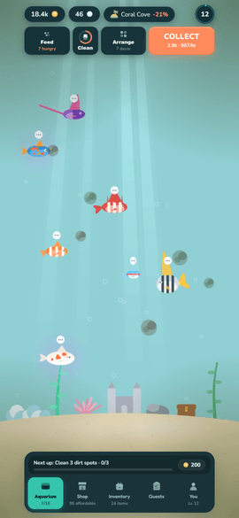
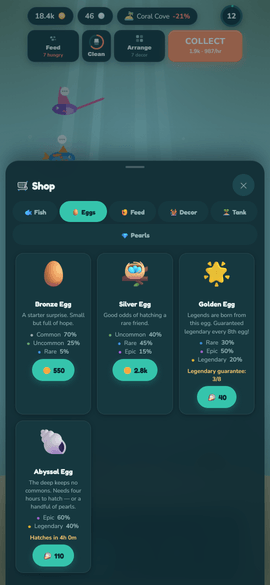
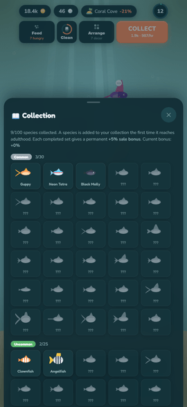

# Reefy 🐠

A cozy aquarium game. You start with a bare tank and two fish, and you end up
with a reef you arranged yourself — species collected one egg at a time, decor
placed where you wanted it, glass you keep clean because dirt costs you income.
There is nothing to lose and nothing to fail; the fish keep earning while the
app is closed, and the game's job is to be worth opening again tomorrow.

**▶ Play it in your browser: <https://eren-ozcan.github.io/reefy/>** — no
install, no account, progress saved in the browser.

On Android it is in closed testing. iOS is built but not submitted.

<p align="center">
  
  
  
</p>

## What you actually do

- **Collect fish.** Buy them, or hatch eggs and find out what is inside — five
  rarities, with a pity counter so a long streak of commons eventually pays out.
- **Care for the tank.** Fish get hungry, glass gets dirty, and both show up in
  what the tank earns per hour. The care bar tells you which one is asking.
- **Grow and sell.** Fish mature over real time; a grown fish sells for more,
  and better feed raises the price further.
- **Decorate.** Decor is not only decoration — a themed set raises the tank's
  growth and income multiplier.
- **Unlock aquariums.** 25 tanks across seven biomes, each with its own look,
  capacity and bonus.
- **Come back.** Daily quests, a weekly quest, a login streak that pays pearls
  on the seventh day, and timed festivals with reward tiers.
- **Compare.** A global ranking through Play Games, plus friend codes for
  visiting other people's reefs.

Coins and pearls are earned by playing. Pearls can also be bought, and a
rewarded ad is offered for pearls — never forced, and an ad-free purchase
removes the interstitial entirely.

## The demo

The link above runs the same code as the shipped app with `VITE_DEMO=1`, which
takes out everything that needs a server or a store:

- **No account, no cloud.** Firebase reports itself unconfigured, so nothing is
  signed in and nothing is written anywhere. Progress lives in `localStorage`
  and clearing site data resets it. Friend codes resolve locally.
- **No ads and no purchases.** Both are native plugins, so a web build already
  falls back to stubs. The shop still lists the pearl packs; tapping one
  declines and points at quests and level rewards instead.
- **No Play Games.** The global ranking and achievements need the native
  layer, so the demo's leaderboard is local.

Everything else — the whole game loop, all 25 tanks, every species and every
decor item — is the real thing.

---

# Building it

Requires Node 22+ (see `.nvmrc`).

```bash
npm install
npm run dev           # dev server at localhost:5173
npm run build         # type-check + production build
npm test              # unit tests (vitest, jsdom)
npm run typecheck     # tsc only, no build
npm run smoke         # Playwright walkthrough against a running dev server
npm run layout:check  # phone-viewport layout checks against a running dev server
npm run icons         # regenerate app icons from tools/icon-src/*.svg
```

The three images at the top are regenerated by `node tools/make-readme-shots.mjs`,
which cuts them down from the store screenshot set (`npm run store:screens --
--lang=en`, which needs a dev server too). They are the only marketing-type
images in this repo and they are here deliberately — everything else of that kind
is kept out, see `CLAUDE.md`.

To build the demo locally: `VITE_DEMO=1 npm run build && npm run preview`.

## Tech stack

- [PixiJS 8](https://pixijs.com/) for 2D rendering
- TypeScript + Vite
- [Capacitor 8](https://capacitorjs.com/) for the Android and iOS shells
- Firebase (Firestore) for cloud save and friend codes
- RevenueCat for in-app purchases, AdMob for ads, Play Games for the ranking
- Vitest for unit tests, Playwright for the smoke and layout runs

## Where things live

| Area | Files |
| --- | --- |
| Species, rarities, egg odds | `src/species.ts`, `src/fish.ts` |
| Tanks and biomes | `src/tanks.ts` |
| Feeds and the hunger loop | `src/feeds.ts` |
| Decor and set bonuses | `src/decor.ts` |
| Quests, weekly quest, achievements | `src/quests.ts` |
| Festivals and their reward tiers | `src/events.ts` |
| Game state and rules | `src/game.ts` |
| All UI and panels | `src/ui.ts`, `src/style.css` |
| Save shape, migration, merge | `src/save.ts`, `src/cloud-save.ts` |
| Platform services (IAP, ads, social) | `src/services.ts`, `src/ads.ts` |
| Translations | `src/i18n.ts` |

## Testing

Unit tests cover the parts that fail silently rather than loudly: what the cloud
save decides to keep or discard (`src/cloud-save.test.ts`), which fields count as
player progress (`src/save.test.ts`), and the scene/cloud-restore race that once
dropped fish mid-session (`src/game-sync.test.ts`). Firestore is faked there — no
network, no emulator needed.

Two Playwright runs are **not** part of `npm test` and each needs a dev server on
port 5173:

- `npm run smoke` plays through the real UI and reports console errors. Run it
  after any change to the HUD or the panels — it clicks real selectors, so it is
  what catches a rename that broke navigation.
- `npm run layout:check` loads the top row and the sheets in their widest state
  at phone size and asserts nothing is clipped by the system navigation bar or
  pushed off the right edge. Both defects it checks for were invisible on a
  desktop browser and obvious on a handset.

## Mobile builds

```bash
npx cap sync android   # copy web build into the Android project
npx cap open android   # open in Android Studio

npx cap sync ios       # same for iOS (requires macOS + Xcode)
npx cap open ios
```

## Service setup

The three integrations below need accounts of their own. Each degrades to a stub
rather than crashing while it is unconfigured, so the game is playable before any
of them is set up.

### In-app purchases (RevenueCat)

The pearl packs in `IAP_PACKS` (`src/services.ts`) are sold through RevenueCat. Before shipping a release build:

1. Create the products in Google Play Console (Monetize > Products) and App Store Connect, using the same ids as `IAP_PACKS` (`pearls-s`, `pearls-m`, `pearls-l`, `pearls-xl`, `starter`).
2. In the RevenueCat dashboard, import those store products and group them into an offering, with package identifiers matching the same ids.
3. Replace the placeholders in `REVENUECAT_API_KEYS` (`src/services.ts`) with your project's public Google/Apple API keys from RevenueCat > Project Settings > API Keys.

Until the API keys are filled in, `RevenueCatIAP` skips configuration and purchases fail with a "not connected" message instead of crashing.

### Friend code verification (Firebase)

Adding a friend by code (`src/services.ts` → `FirebaseSocial`) checks a Firestore
collection (`players/{friendCode}`) to confirm the code is real and to fetch the
real player name, instead of blindly accepting any well-formed code (`LocalSocial`'s
fallback behavior when Firebase isn't configured — see `isFirebaseConfigured()` in
`src/firebase-config.ts`).

This uses a **separate, dedicated Firebase project for Reefy** — each game gets its
own Firebase/GCP project, never shared with another title.

Setup:

1. Create a new Firebase project (`npx firebase projects:create`, or via
   [console.firebase.google.com](https://console.firebase.google.com)).
2. Enable **Firestore** in Native mode (`npx firebase firestore:databases:create`)
   — pick the region carefully, it can't be changed later.
3. Enable **Anonymous Authentication**: Console → Authentication → Sign-in method →
   Anonymous → Enable. `firebase-tools` has no CLI command for this, it's a
   one-time manual toggle.
4. Register a Web app in the project (`npx firebase apps:create WEB "Reefy Web"`),
   then fetch its config (`npx firebase apps:sdkconfig WEB <appId>`) and paste the
   values into `src/firebase-config.ts` (`FIREBASE_CONFIG`), replacing the
   `REPLACE_WITH_...` placeholders. These values are public identifiers safe to
   embed client-side (like the RevenueCat key above) — the actual protection is
   the security rules below.
5. Deploy the security rules from the repo: `npx firebase deploy --only firestore:rules`
   (rules source: `firestore.rules`). They allow anyone signed in (anonymously) to
   `get` a single player doc by its exact code, but disallow `list` — so friend
   codes can be validated one at a time but not scraped/enumerated. Writes are
   restricted to the doc's own owner (`uid` match).

Until `FIREBASE_CONFIG` is filled in, `isFirebaseConfigured()` is false and
`createServices()` falls back to `LocalSocial`, which accepts any correctly
formatted code without checking whether it's real.

### Ads (AdMob)

Ad unit IDs live in `src/ads.ts` (`INTERSTITIAL_AD_IDS`, `REWARDED_AD_IDS`), registered under the "Reefy" app in [AdMob](https://apps.admob.com) for both Android and iOS. The Android app ID is also declared in `android/app/src/main/AndroidManifest.xml` (`com.google.android.gms.ads.APPLICATION_ID` meta-data) and the iOS one in `ios/App/App/Info.plist` (`GADApplicationIdentifier`) — both are required by the native SDK independently of the ad unit IDs used at runtime.

Before shipping:

1. Add payment details in the AdMob dashboard (Payments) — ad units won't serve without it.
2. Once the app is live on Play Store / App Store, link it from AdMob (Apps > Reefy > App settings) so it moves out of the "unlisted" review state.
3. Set up the matching `remove-ads` store product (Google Play Console / App Store Connect) and RevenueCat package so the "Reklamları Kaldır" purchase works end to end.
4. Publish a UMP privacy message for the app (AdMob > Privacy & messaging). Without
   one the consent step fails with "Publisher misconfiguration" and no ad ever
   serves — the failure is silent unless you read the diagnostic line in Settings.

## Roadmap

[`TODO.md`](TODO.md) carries the current roadmap, the known gaps and what the
last release did and did not settle.
